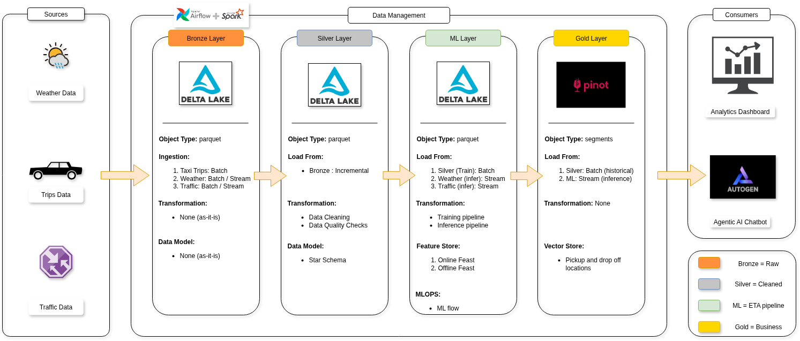

ETA: Estimated Time of Arrival

---

## Problem Statement

Using historical taxi trip data, build a predictive model to estimate the time of arrival for the taxi trips in NYC (New York City). 

---

## Project Scope

The goal is to develop a machine learning model that can accurately estimate travel times based on various factors such as pickup and drop-off locations, time of day, and traffic conditions.

The key objectives include (Inclusions):

- Build a predictive model for ETA.
- Build a BI dashboard for data visualization and analysis, highlighting patterns and trends in taxi travel times.
- Develop an interactive chatbot to simulate real-time data streaming and answer ad-hoc queries using MCP (Model Context Protocol).

Exclusions:

- Implementing dynamic pricing models.
- Route optimization strategies.

---

## Success Metrics

- ETA prediction should be ≤ 5 minutes difference (RMSE) for 90% of trips.
- Dashboard should provide clear view of travel time patterns with respect to various factors (e.g., time of day, weather conditions).
- Chatbot should able to trigger inference pipeline for real-time ETA predictions.

---

## Functional Requirements

---

## Non-Functional Requirements

--

## Architecture

- Following the medallion architecture pattern, the project will be organized into multiple layers:
  - **Bronze Layer**: Raw data ingestion and storage.
  - **Silver Layer**: Data cleaning, transformation, and enrichment.
  - **ML Layer**: Model training, evaluation, and deployment.
  - **Gold Layer**: Aggregated and curated datasets for analysis and modeling.

